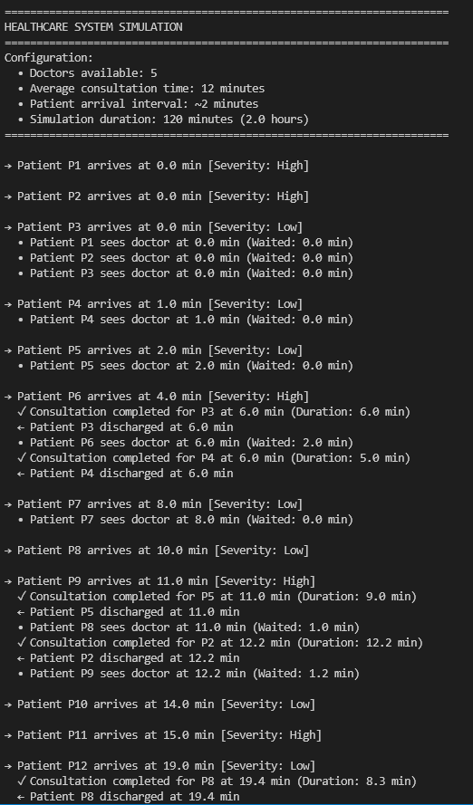

# 🏥 Hospital Emergency Room Simulation

This project contains a **Discrete-Event Simulation (DES)** model built with Python and SimPy to analyze patient flow and resource utilization in an Emergency Department.

## 🎯 Goal

To test how **patient severity** (case complexity) impacts **doctor utilization** and **patient wait times** under different operating conditions.

## ⚙️ Configuration

The core variables for this simulation are set at the top of the Python file:

| Parameter | Value in Code |
| :--- | :--- |
| **Doctors Available** | 5 |
| **Base Consultation Time** | 12 minutes |
| **Mean Arrival Interval** | 2 minutes |
| **Simulation Duration** | 120 minutes |

##  Key Results

The simulation tracks and reports the following key metrics:

* **Doctor Utilization (%)**
* **Average Wait Time (min)**
* **Maximum Wait Time (min)**
* **Throughput (patients/hour)**

## ▶️ How to Run

1.  **Prerequisites:** Install Python and the required libraries:
    ```bash
    pip install simpy numpy
    ```
2.  **Execution:** Save the entire code as a single file (e.g., `HER_Simulation.py`) and run it from your terminal:
    ```bash
    python HER_simulation.py
    ```
## Sample outputs



